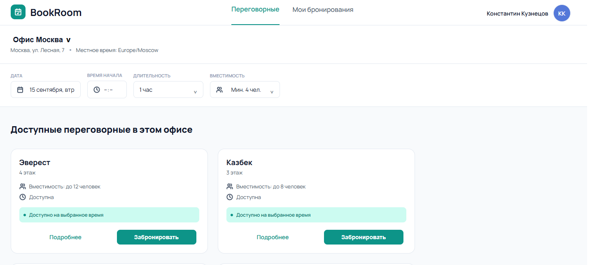
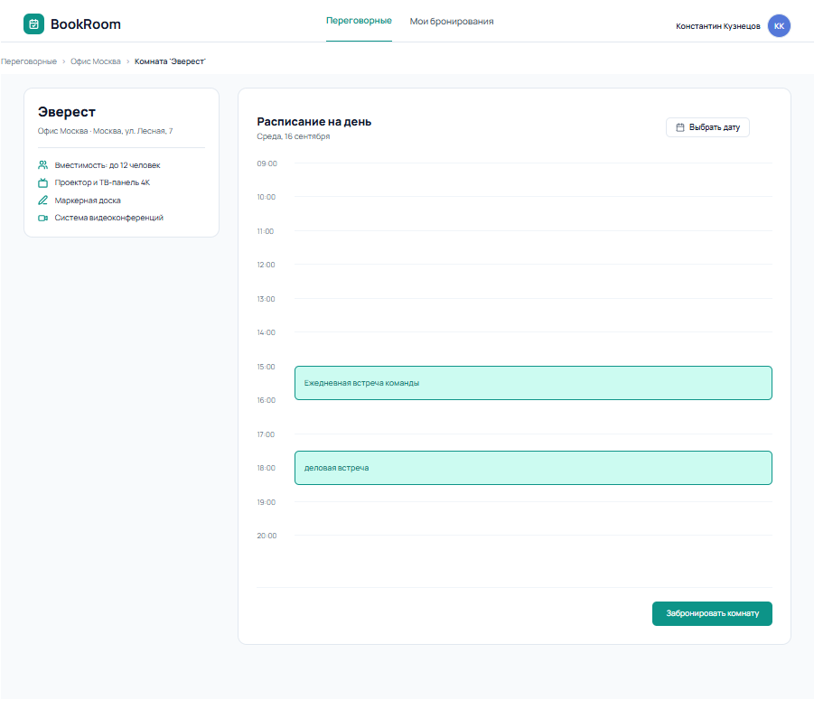
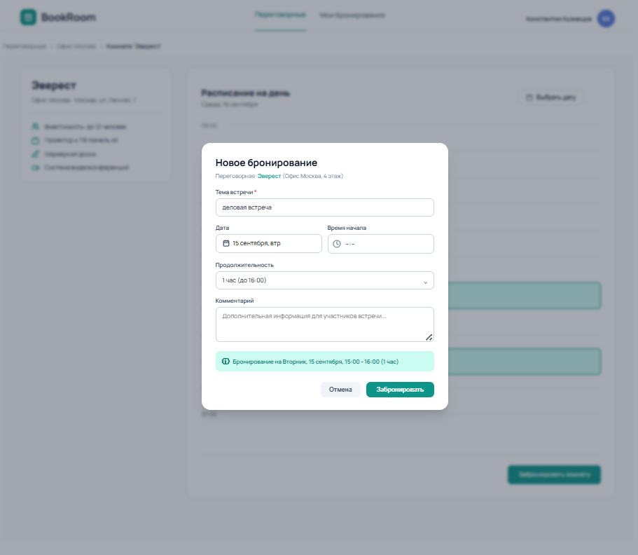
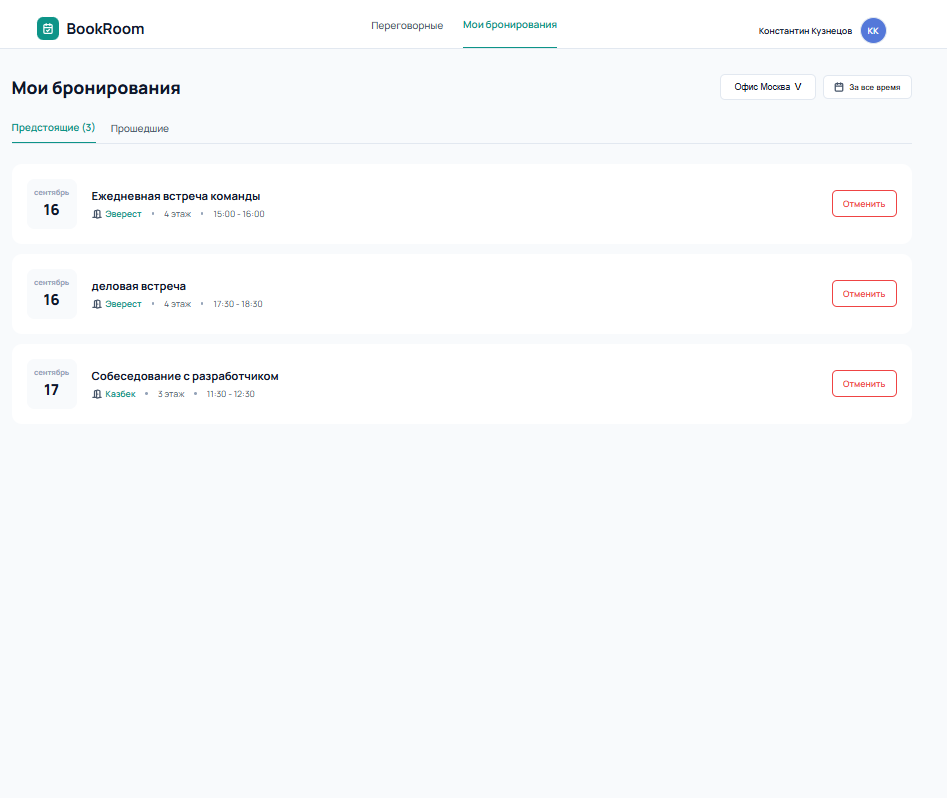
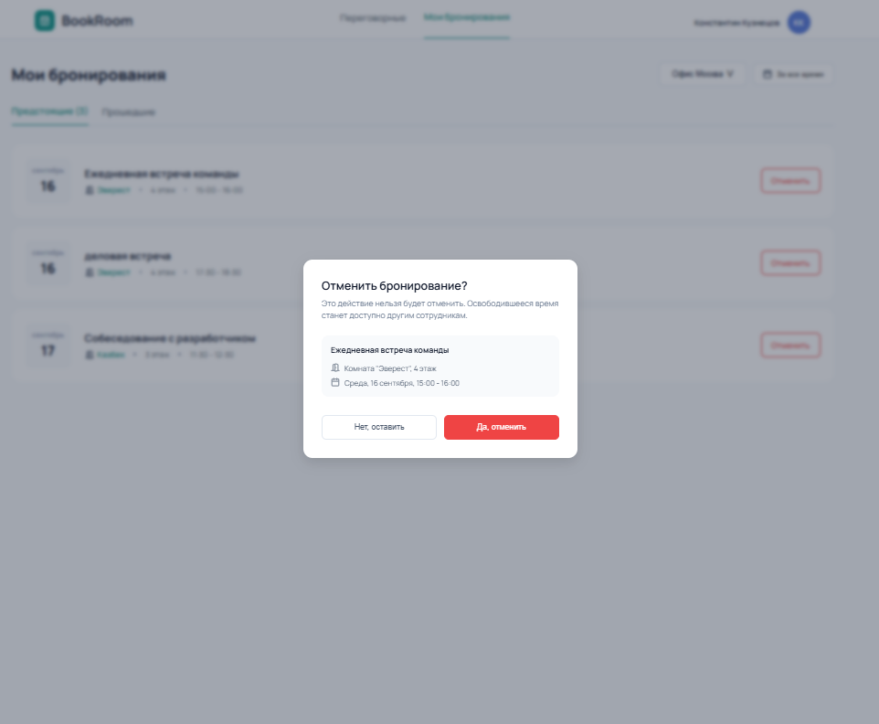

# BookRoom - система бронирования переговорных комнат в офисах

Веб-приложение для просмотра переговорных комнат, проверки их доступности и бронирования временных слотов.

Приложение состоит из frontend- и backend-частей. Данные о комнатах и бронированиях загружаются через REST API, а изменения в реальном времени синхронизируются между пользователями с помощью WebSocket.

---

## Скриншоты







---

## Запуск проекта

### 1. Backend

Перейдите в директорию сервера:

```bash
cd server
```
Установите зависимости:

```bash
npm install
```

Запустите сервер в режиме разработки:
```bash
npm run dev
```


### 2. Frontend

Перейдите в директорию клиента:

```bash
cd client
```

Установите зависимости:

```bash
npm install
```

Запустите приложение:
```bash
npm run dev
```

После запуска Vite выведет локальный адрес приложения в терминале.


## Тестирование

Для запуска frontend-тестов:

```bash
cd client
npm run test:run
```

Для запуска Vitest в watch-режиме:
```bash
npm run test
```

Тесты проверяют поведение компонентов и взаимодействие пользователя с интерфейсом, включая сценарии, связанные с realtime-обновлениями через WebSocket.
Например:

* загрузку данных комнаты;
* обработку ошибок;
* открытие формы бронирования;
* отображение уведомлений;
* обработку WebSocket-событий;
* обновление данных после событий реального времени.


## Технологии

### Frontend

* React 19 - основа пользовательского интерфейса.
* TypeScript - статическая типизация компонентов, API-моделей и бизнес-логики.
* Vite - dev-сервер и сборщик frontend-приложения.
* React Router — клиентская маршрутизация между страницами приложения.
* Axios - HTTP-клиент для взаимодействия с backend REST API.
* WebSocket - получение изменений в реальном времени без необходимости постоянно опрашивать сервер.
* Lucide React - набор SVG-иконок для интерфейса.


### Работа с датами и временем

* date-fns - работа с датами: форматирование, сравнение и вычисление временных интервалов.
* date-fns-tz - работа с часовыми поясами и корректное отображение времени с учётом timezone офиса.
* React DatePicker - выбор даты в интерфейсе бронирования.

Использование timezone особенно важно для системы бронирования: время доступности комнаты должно отображаться в часовом поясе соответствующего офиса, а не просто в локальном времени браузера.


### Realtime

Для синхронизации состояния между пользователями используется **WebSocket**.

После установления соединения клиент получает события от сервера, например:
* создание нового бронирования;
* сброс или обновление данных;
* изменения, которые должны быть отображены на других клиентах.

При потере соединения frontend автоматически пытается переподключиться. Пользователь при этом получает уведомление о состоянии соединения.

Это позволяет нескольким пользователям работать с системой одновременно и видеть актуальное состояние бронирований без ручного обновления страницы.


Backend API настроен для взаимодействия с frontend, запущенным на отдельном origin в режиме разработки, включая поддержку необходимых HTTP-методов через CORS.


### Тестирование

* Vitest - тестовый раннер.
* React Testing Library - тестирование React-компонентов через пользовательское поведение.
* @testing-library/user-event - эмуляция действий пользователя: клики, ввод и другие взаимодействия.
* jest-dom - дополнительные DOM-ассерты для проверки состояния интерфейса.
* jsdom - браузерное окружение для запуска frontend-тестов в Node.js.

Особое внимание уделено тестированию асинхронных сценариев и WebSocket-событий, например обновлению календаря после получения события booking.created.


### Code Quality

* Oxlint - быстрый статический анализатор кода и проверка распространённых проблем.


## Структура проекта
```text
.
├── client/
│   ├── src/
│   │   ├── api/                  # Работа с backend API
│   │   ├── assets/               # Изображения, иконки и другие статические ресурсы
│   │   ├── components/           # Переиспользуемые UI-компоненты
│   │   ├── context/              # React Context для глобального состояния
│   │   │   └── CurrentUserContext.tsx
│   │   ├── pages/                # Страницы приложения
│   │   │   ├── Rooms/
│   │   │   ├── RoomDetails/
│   │   │   ├── Bookings/
│   │   │   └── NotFound/
│   │   ├── realtime/             # WebSocket и realtime-синхронизация
│   │   ├── test/                 # Общая конфигурация тестового окружения
│   │   │   └── setup.ts
│   │   ├── types/                # TypeScript-типы и интерфейсы
│   │   ├── utils/                # Вспомогательная и бизнес-логика работы с бронированием
|   |   │   ├── booking.ts
|   |   │   └── booking.test.ts
│   │   ├── App.tsx               # Корневой компонент и маршрутизация
│   │   └── main.tsx              # Точка входа приложения
│   ├── package.json
│   ├── vite.config.ts
│   ├── tsconfig.json
│   └── ...
│
├── server/                       # Backend приложения
│   ├── ...
│   └── package.json
│
└── README.md                     # Документация и инструкция по запуску
```


## Основные возможности

* Просмотр списка переговорных комнат.

* Просмотр подробной информации о комнате.
* Просмотр календаря бронирований.
* Создание бронирования.
* Отмена бронирования.
* Работа с датами и часовыми поясами.
* Получение актуальных изменений через WebSocket.
* Автоматическое переподключение при потере WebSocket-соединения.
* Индикация состояния realtime-соединения.
* Обработка ошибок загрузки данных.
* Адаптация интерфейса под различные состояния приложения: состояния загрузки, ошибок, пустых данных
* Покрытие ключевой логики frontend тестами


## Realtime-синхронизация

Приложение использует событийную модель для обновления данных.

Например, после создания бронирования сервер отправляет событие:
```text
booking.created
```

Клиент проверяет, относится ли событие к текущей комнате, и при необходимости обновляет календарь.

Это позволяет избежать постоянного polling API и поддерживать интерфейс актуальным практически в реальном времени.


## Доступные команды

### Client

| Команда            | Назначение                              |
| ------------------ | --------------------------------------- |
| `npm run dev`      | Запуск frontend в режиме разработки     |
| `npm run build`    | Проверка TypeScript и production-сборка |
| `npm run lint`     | Проверка кода с помощью Oxlint          |
| `npm run test`     | Запуск тестов в watch-режиме            |
| `npm run test:run` | Однократный запуск всех тестов          |
| `npm run preview`  | Локальный просмотр production-сборки    |

